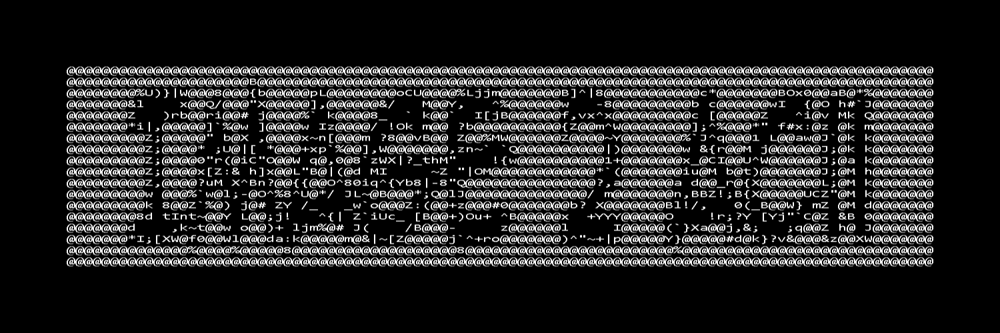

# img2ascii: A URL Shortener
This is a small application that converts any image into ascii art and outputs the .txt file
## Table of Contents

- [Features](#features)
- [Installation](#installation)
- [Usage](#usage)
- [Screenshots](#screenshots)

## Features

- Convert any image into ascii art
- Simple user interface
- Generates a .txt file with the ascii art

## Installation

### Server Installation

To install and run the Smolink server (Flask) locally, follow these steps:

1. Clone this repository:

    ```
    git clone https://github.com/mespino4/img2ascii
    ```

2. Run the Python file:

    ```
    python main.py
    ```

## Usage

To convert an image to ascii art follow these steps

1. Run the python file
2. Drop an image file into the dialog box or click on the "Choose Image" button
3. If you clicked on the choose image button, select an image from the file explorer
4. Open the .txt file that was generated to see the ascii art

## Screenshots


